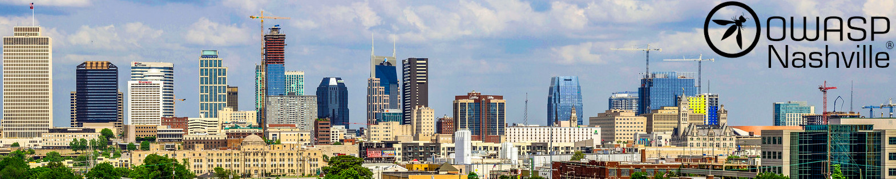

---

layout: col-sidebar
title: OWASP Nashville
site_side: true
tags: nashville
level: 3
region: North America
currency: usd
meetup-group: OWASP-Nashville-Chapter
country: USA
postal-code: 37201

---

# Welcome to the OWASP Nashville Chapter!

Although COVID has created unprecedented challenges for all of us, OWASP Nashville is alive and well! See below for details on our next event!

The chapter leaders are [Mark Geeslin](mailto:mark.geeslin@owasp.org), [Joel Tomassini](mailto:joel.tomassini@owasp.org), [Brandon Evans](mailto:brandon.evans@owasp.org), and Casey Rosini.

# Want to speak at a future meeting?

We have a [CFP hosted by PaperCall.io](https://www.papercall.io/owasp-nashville). All talks are welcome that are germane to OWASP. We await your submissions!

# Next Meeting / Event

Stay tuned!

OWASP Nashville meetings are posted on our Meetup page. Please visit [http://www.meetup.com/OWASP-Nashville-Chapter](http://www.meetup.com/OWASP-Nashville-Chapter) for all chapter event information.

Join the OWASP Nashville group on [Meetup](http://www.meetup.com/OWASP-Nashville-Chapter) to be notified when the details of the next event are published.

# Participation

The Open Web Application Security Project (OWASP) is a nonprofit foundation that works to improve the security of software. All of our projects, tools, documents, forums, and chapters are free and open to anyone interested in improving application security. 

Chapters are led by local leaders in accordance with the [Chapter Leader Handbook](/www-policy/operational/chapter-handbook-existing). Financial contributions should be made online using the authorized online donation channels. To be a speaker at any OWASP Chapter in the world simply review the [speaker agreement](/www-policy/legal/speaker-agreement) and then contact the local chapter leader with details of what OWASP Project, independent research, or related software security topic you would like to present.

Everyone is welcome and encouraged to participate in our [Projects](/projects), [Local Chapters](/chapters), and [Events](/events). We especially encourage diversity in all our initiatives. OWASP is a fantastic place to learn about application security, to network, and even to build your reputation as an expert. We also encourage you to [become a member](/membership) or consider a [donation](/donate) to support our ongoing work.
